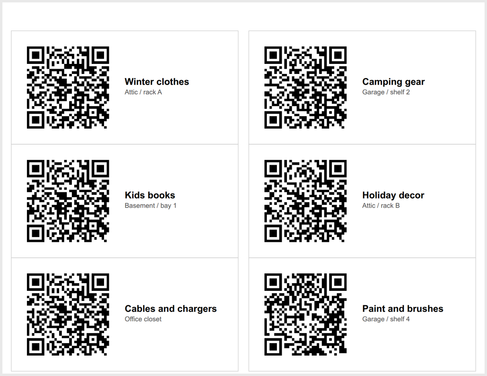

# qrc

A CLI that generates QR codes for the things people actually scan: contact
cards, phone numbers, emails, URLs — and printable sheets of labels for the
boxes and bins in your garage.

```console
$ qrc url gtech.io
```

```
█████████████████████████████████
█████████████████████████████████
████ ▄▄▄▄▄ ██ ▄▄█▀ ▄▄█ ▄▄▄▄▄ ████
████ █   █ █▀▀▀▄▀█ ▄▄█ █   █ ████
████ █▄▄▄█ █▀▄█▀▀▄▄▄ █ █▄▄▄█ ████
████▄▄▄▄▄▄▄█ █▄▀▄█ ▀ █▄▄▄▄▄▄▄████
████▀▄▄█▀▀▄██▀█▀▀  ▀ ▀  █ █▀▀████
████▄ ▀▀██▄██▀▄▄▀▀█▄██▄▀█ ▄█▄████
█████▄█ ▀▄▄▀▀▄ ▄▀ █▀ █  ███▀ ████
████▄▄▄▄ ▄▄▀██▄█▀▀▄  ▀▄▀▀ ▄█▄████
████▄▄▄█▄█▄█▀▄ █▄ ▄█ ▄▄▄ ██▄▀████
████ ▄▄▄▄▄ ██▄▄ ▀▀▀█ █▄█ ███▄████
████ █   █ ██▄ ██▀▄▄▄ ▄▄ █▀ ▄████
████ █▄▄▄█ █ ▀█ ▄  ▄▀▄█  ▄█▄▄████
████▄▄▄▄▄▄▄███▄█▄███▄████▄██▄████
█████████████████████████████████
█████████████████████████████████
```

No output file? You get the code in your terminal. Pass `-o` and you get a
PNG, SVG, EPS, PDF or plain-text file instead.

## Install

```bash
uv tool install git+https://github.com/gtech-io/qrc-gen
```

Or run it without installing:

```bash
uvx --from git+https://github.com/gtech-io/qrc-gen qrc url gtech.io
```

## Single codes

```bash
qrc url gtech.io/docs                       # https:// is added for you
qrc email ada@gtech.io --subject "Hello"    # mailto: with a pre-filled subject
qrc phone "+1 (555) 010-9999"               # dials when scanned
qrc sms "+15550109999" -m "on my way"       # pre-addressed text message
qrc text "anything at all"                  # raw text

qrc contact \
  --name "Ada Lovelace" \
  --org "Analytical Engines, Ltd" \
  --title "Principal Engineer" \
  --phone "+15550109999" \
  --email ada@gtech.io \
  --url gtech.io \
  -o ada.png
```

`contact` emits vCard 3.0 rather than 4.0 — it is what iOS and Android camera
apps parse reliably, and 4.0 buys nothing at this size.

Every command takes the same output options:

| Option | What it does |
| --- | --- |
| `-o, --output` | File to write. The extension picks the format: `.png` `.svg` `.eps` `.pdf` `.txt` |
| `-e, --error` | Error correction: `l` `m` `q` `h` (7% / 15% / 25% / 30% recoverable) |
| `-s, --scale` | Pixels (or points) per QR module |
| `-b, --border` | Quiet-zone width in modules |
| `--dark` / `--light` | Colours. `--light none` gives a transparent background |
| `--print-payload` | Print the encoded string instead of a code — useful for debugging |

## Storage labels

The part this tool exists for. Label the totes in the attic, print the sheet,
stick them on, and scan a box to see what's inside.

A single label:

```bash
qrc label BIN-042 --base-url inv.gtech.io -o bin-042.png
# encodes https://inv.gtech.io/BIN-042
```

Without `--base-url` the code carries the bare id, so it still works with an
offline spreadsheet:

```bash
qrc label BIN-042 --extra loc="shelf 3" --print-payload
# BIN-042
# loc=shelf 3
```

### Printable sheets

Number a run of bins and lay them out on label stock:

```bash
qrc sheet --prefix BIN- --count 30 --base-url inv.gtech.io \
  --preset avery-5160 -o bins.svg
```

Or drive it from a CSV, which is how you get real captions on the labels:

```csv
id,caption,subtitle
TOTE-01,Winter clothes,Attic / rack A
TOTE-02,Camping gear,Garage / shelf 2
TOTE-03,Kids books,Basement / bay 1
```

```bash
qrc sheet --csv inventory.csv --base-url inv.gtech.io \
  --preset avery-5163 --cut-lines -o labels.svg
```



Columns are `id` (or `payload`, to encode something arbitrary), `caption` and
`subtitle`. Anything past the first page is written to `labels-2.svg`,
`labels-3.svg` and so on.

Half a sheet of labels left over? `--skip 4` leaves the first four cells blank
so you can feed it back through the printer.

**Print at 100% scale, not "fit to page."** The SVG is laid out in real
millimetres, so scaling it is what makes labels miss their backing paper.

### Label stock

```console
$ qrc presets
avery-5160     3x10 = 30 per page  (66.675 x 25.4 mm on 215.9 x 279.4 mm)
avery-5163     2x5 = 10 per page  (101.6 x 50.8 mm on 215.9 x 279.4 mm)
avery-l7159    3x8 = 24 per page  (63.5 x 33.9 mm on 210 x 297 mm)
cut-4x3        3x4 = 12 per page  (60 x 60 mm on 215.9 x 279.4 mm)
```

`cut-4x3` is for plain paper — twelve 60mm squares with `--cut-lines` as
cutting guides.

Sheets default to `--error h`, the 30% error-correction level, because printed
labels get scuffed, faded and partly peeled.

## Development

```bash
uv sync --group decode
uv run pytest
uv run ruff check .
```

The `decode` group installs OpenCV for `tests/test_roundtrip.py`, which renders
codes and scans them back with a decoder that is not our own code. That test
rasterizes a full label sheet through headless Chrome and decodes every cell,
which is how a two-module quiet zone that looked fine to the eye — and failed
on real scanners — got caught.

## Licence

MIT
